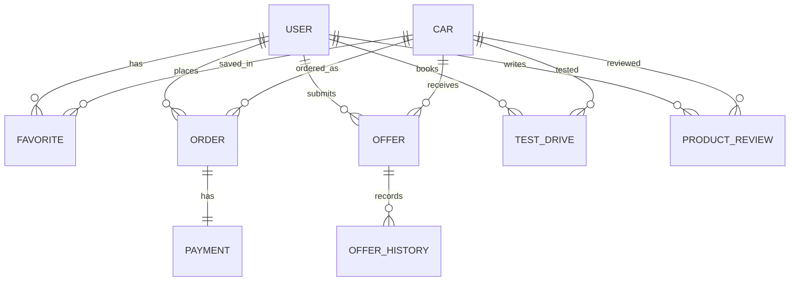
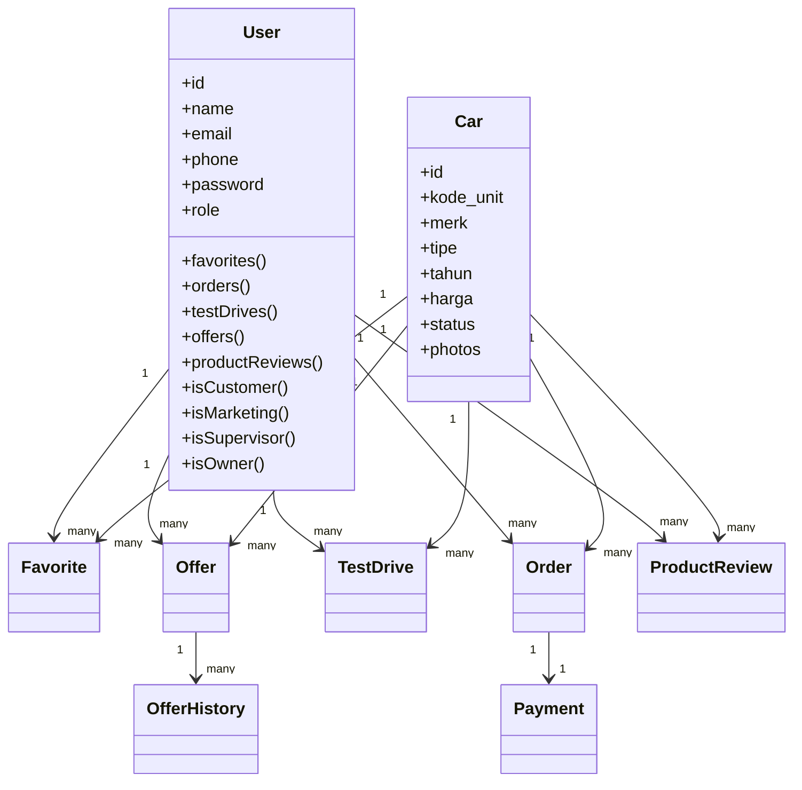

# Naskah Penjelasan Sistem Maharani Mobil App

Dokumen ini menjelaskan sistem **Maharani Mobil App** berdasarkan implementasi yang aktif pada project saat ini. Penjelasan disusun dari struktur route, model, relasi data, proses bisnis, dan fitur yang benar-benar digunakan di dalam aplikasi.

---

## 1. Gambaran Umum Sistem

Maharani Mobil App adalah sistem informasi penjualan mobil bekas yang membantu showroom mengelola proses bisnis dari awal sampai akhir, mulai dari publik melihat katalog mobil, customer melakukan penawaran atau pemesanan, supervisor memvalidasi transaksi, marketing memantau aktivitas penjualan, sampai owner melihat rekapitulasi dan laporan penjualan.

Sistem ini tidak hanya berfungsi sebagai katalog mobil, tetapi juga sebagai sistem operasional showroom. Di dalamnya sudah ada proses:

- pengelolaan data mobil
- pengelolaan penawaran harga
- booking test drive
- pemesanan mobil
- pembayaran
- validasi transaksi
- pengelolaan dokumen transaksi
- review customer
- monitoring penjualan
- laporan penjualan

Dengan adanya sistem ini, proses yang sebelumnya manual menjadi lebih terstruktur, terdokumentasi, dan mudah dipantau oleh setiap peran pengguna.

---

## 2. Aktor Sistem

Pada sistem ini terdapat **5 aktor utama**:

### 2.1 Pengunjung

Pengunjung adalah orang yang belum login ke sistem. Pengunjung hanya dapat melihat informasi publik, seperti:

- halaman beranda
- katalog mobil
- detail mobil
- ulasan customer
- halaman tentang kami, FAQ, privasi, dan syarat penggunaan

Pengunjung belum bisa melakukan aksi transaksi sebelum login atau register.

### 2.2 Customer

Customer adalah pengguna yang ingin membeli mobil atau menggunakan layanan showroom. Customer dapat:

- login dan register
- melihat katalog dan detail mobil
- menyimpan mobil ke favorit
- mengajukan penawaran harga
- booking test drive
- memesan mobil
- memilih metode beli cash atau kredit
- mengunggah bukti pembayaran
- melihat tracking pesanan
- melihat dokumen transaksi
- menulis review setelah pembelian atau test drive selesai
- mengelola profil akun

### 2.3 Marketing

Marketing bertugas mengelola data produk dan memantau aktivitas penjualan. Marketing dapat:

- melihat dashboard marketing
- mengelola data mobil / produk
- memantau pesanan
- memantau penawaran
- memantau test drive
- memantau transaksi
- memantau data customer
- mengelola pengaturan akun marketing

Marketing lebih berfokus pada pemantauan dan pengelolaan produk serta aktivitas customer.

### 2.4 Supervisor

Supervisor adalah aktor operasional utama dalam sistem. Supervisor dapat:

- mengelola data mobil
- mengelola pesanan customer
- memvalidasi pembayaran
- mengelola transaksi showroom
- mengelola test drive
- mengelola penawaran
- mengelola customer
- mengelola user internal
- melihat aktivitas sistem
- melihat laporan penjualan versi supervisor
- mengelola dokumen transaksi
- mengelola pengaturan supervisor

Supervisor berperan besar dalam memastikan transaksi berjalan sah, lengkap, dan sesuai proses bisnis showroom.

### 2.5 Owner

Owner adalah pimpinan yang berfokus pada pengambilan keputusan. Owner dapat:

- melihat dashboard owner
- melihat laporan penjualan
- melihat rekap transaksi
- melihat pola pembelian cash dan kredit
- mengekspor laporan PDF / Excel
- mengelola pengaturan owner

Owner tidak terlibat langsung dalam operasional harian, tetapi menggunakan sistem untuk analisis dan evaluasi bisnis.

---

## 3. Proses Bisnis Sistem

## 3.1 Proses Bisnis Penjualan

Alur penjualan dalam sistem secara umum adalah sebagai berikut:

1. Pengunjung membuka website dan melihat katalog mobil.
2. Jika tertarik, pengunjung login atau register sebagai customer.
3. Customer melihat detail mobil dan dapat:
   - menambahkan ke favorit
   - mengajukan penawaran
   - booking test drive
   - langsung melakukan pemesanan
4. Jika customer melakukan pemesanan, customer memilih metode beli:
   - **cash**
   - **kredit**
5. Sistem menyimpan data pesanan dan status awal pesanan menjadi `pending`.
6. Jika pembelian cash, customer melanjutkan ke pembayaran.
7. Jika pembelian kredit, customer mengirim pengajuan kredit, lalu supervisor meninjau pengajuan tersebut.
8. Customer mengunggah bukti pembayaran atau pembayaran DP.
9. Supervisor memverifikasi atau menolak pembayaran.
10. Jika pembayaran tervalidasi, status pesanan diperbarui.
11. Sistem menyiapkan dokumen transaksi, seperti:
   - faktur
   - kwitansi
   - berita acara serah terima kendaraan (BAST)
12. Setelah transaksi selesai, customer dapat melihat dokumen dan menulis review.

## 3.2 Proses Bisnis Penawaran

1. Customer membuka detail mobil.
2. Customer mengisi nominal penawaran.
3. Sistem menyimpan penawaran.
4. Supervisor memeriksa penawaran.
5. Supervisor dapat:
   - memberi tawaran balik
   - menerima harga
   - menolak penawaran
6. Semua proses negosiasi disimpan di histori penawaran.
7. Jika harga disepakati, customer dapat lanjut checkout.

## 3.3 Proses Bisnis Test Drive

1. Customer memilih unit mobil.
2. Customer memilih tanggal, jam, dan lokasi test drive.
3. Sistem menyimpan booking test drive dengan status `pending`.
4. Supervisor meninjau permintaan test drive.
5. Jika disetujui, test drive dijadwalkan.
6. Setelah test drive selesai:
   - customer dapat lanjut ke transaksi
   - atau transaksi tidak dilanjutkan

## 3.4 Proses Bisnis Review Customer

1. Customer yang sudah menyelesaikan pembelian atau test drive dapat menulis review.
2. Sistem hanya menampilkan unit yang **belum pernah direview** oleh customer tersebut.
3. Customer mengisi:
   - unit
   - rating
   - komentar
   - foto review
4. Sistem menyimpan review.
5. Review tampil pada halaman ulasan customer dan overview home.

## 3.5 Proses Bisnis Rekapitulasi Penjualan

1. Data transaksi disimpan dari order, payment, dan status operasional.
2. Supervisor memastikan data transaksi valid dan lengkap.
3. Marketing memantau hasil transaksi dan aktivitas customer.
4. Sistem mengolah data menjadi laporan penjualan.
5. Owner memilih periode laporan:
   - mingguan
   - bulanan
   - tahunan
6. Sistem menampilkan rekap penjualan, omzet, rata-rata transaksi, metode pembelian, dan tren.
7. Laporan dapat diekspor ke PDF atau Excel.

---

## 4. Entitas yang Digunakan

Berikut entitas utama yang digunakan dalam sistem.

### 4.1 User

Entitas `User` menyimpan seluruh akun pengguna sistem.

Fungsi:

- menyimpan data akun customer
- menyimpan akun marketing
- menyimpan akun supervisor
- menyimpan akun owner

Field penting:

- `id`
- `name`
- `email`
- `phone`
- `password`
- `role`
- `provider`
- `provider_id`
- `avatar`

Role yang digunakan:

- `customer`
- `marketing`
- `supervisor`
- `owner`

### 4.2 Car

Entitas `Car` menyimpan data unit mobil.

Field penting:

- `id`
- `kode_unit`
- `merk`
- `tipe`
- `tahun`
- `harga`
- `kilometer`
- `transmisi`
- `warna`
- `bahan_bakar`
- `status`
- `deskripsi`
- `photos`
- `created_by`

Status mobil:

- `available`
- `reserved`
- `sold`

### 4.3 Favorite

Entitas `Favorite` menyimpan mobil yang disukai customer.

Field penting:

- `id`
- `user_id`
- `car_id`

Entitas ini menjadi penghubung antara customer dan mobil favorit.

### 4.4 Offer

Entitas `Offer` menyimpan penawaran harga customer terhadap mobil.

Field penting:

- `id`
- `user_id`
- `car_id`
- `offer_price`
- `counter_price`
- `final_price`
- `negotiation_round`
- `last_offer_by`
- `status`
- `customer_channel`
- `notes`
- `follow_up_status`
- `lost_reason`
- `next_follow_up_at`
- `handled_by`
- `handled_role`
- `handled_at`

Status penawaran:

- `pending`
- `countered`
- `accepted`
- `rejected`

### 4.5 OfferHistory

Entitas `OfferHistory` menyimpan riwayat negosiasi penawaran.

Field penting:

- `id`
- `offer_id`
- `actor_role`
- `action`
- `offered_price`
- `note`

Entitas ini penting agar proses negosiasi tercatat dengan jelas.

### 4.6 TestDrive

Entitas `TestDrive` menyimpan data booking test drive.

Field penting:

- `id`
- `order_id`
- `user_id`
- `car_id`
- `booking_date`
- `booking_time`
- `status`
- `customer_channel`
- `notes`
- `follow_up_status`
- `lost_reason`
- `next_follow_up_at`
- `handled_by`
- `handled_role`
- `handled_at`

### 4.7 Order

Entitas `Order` adalah inti transaksi pembelian mobil.

Field penting:

- `id`
- `order_code`
- `user_id`
- `car_id`
- `status`
- `total`
- `payment_method`
- `leasing_partner`
- `credit_dp_percentage`
- `credit_dp_amount`
- `credit_tenor_months`
- `credit_monthly_installment`
- `credit_interest_rate`
- `transaction_channel`
- `sales_flow`
- `notes`
- `cancel_reason`
- `follow_up_status`
- `next_follow_up_at`
- `handled_by`
- `handled_role`
- `handled_at`
- `approved_by`
- `approved_at`
- `document_status`

Status order:

- `pending`
- `confirmed`
- `paid`
- `completed`
- `cancelled`

### 4.8 Payment

Entitas `Payment` menyimpan data pembayaran untuk pesanan.

Field penting:

- `id`
- `order_id`
- `method`
- `gateway_provider`
- `gateway_reference`
- `gateway_external_id`
- `gateway_checkout_url`
- `gateway_status`
- `gateway_channel`
- `gateway_payload`
- `amount`
- `paid_at`
- `proof_file`
- `status`
- `verified_by`
- `verified_at`
- `handled_by`
- `handled_role`
- `handled_at`

Status pembayaran:

- `pending`
- `verified`
- `rejected`

### 4.9 ProductReview

Entitas `ProductReview` menyimpan ulasan customer terhadap mobil atau pengalaman test drive.

Field penting:

- `id`
- `user_id`
- `car_id`
- `source_type`
- `source_id`
- `rating`
- `review_text`
- `media_path`
- `media_paths`
- `status`
- `admin_notes`
- `verified_by`
- `verified_at`

Entitas ini mendukung review berbasis pembelian maupun test drive.

---

## 5. ERD Sistem

Secara konsep, ERD sistem Maharani Mobil App dapat dijelaskan sebagai berikut:

### 5.1 Relasi utama

- **User** memiliki banyak **Favorite**
- **User** memiliki banyak **Order**
- **User** memiliki banyak **Offer**
- **User** memiliki banyak **TestDrive**
- **User** memiliki banyak **ProductReview**
- **Car** memiliki banyak **Order**
- **Car** memiliki banyak **Offer**
- **Car** memiliki banyak **TestDrive**
- **Car** memiliki banyak **ProductReview**
- **Car** memiliki banyak **Favorite**
- **Order** memiliki satu **Payment**
- **Order** dapat terhubung ke satu **ProductReview** pembelian
- **Offer** memiliki banyak **OfferHistory**
- **TestDrive** dapat terhubung ke **Order**

### 5.2 Narasi ERD

1. Satu user customer dapat menyimpan banyak mobil favorit.
2. Satu user customer dapat membuat banyak pesanan.
3. Satu mobil dapat dipesan berkali-kali dalam histori, tetapi pada saat aktif hanya mengikuti status transaksi terkini.
4. Setiap pesanan memiliki satu data pembayaran utama.
5. Satu mobil dapat menerima banyak penawaran dari customer yang berbeda.
6. Setiap penawaran memiliki histori negosiasi agar perubahan harga tercatat.
7. Satu customer dapat membuat beberapa test drive.
8. Satu customer dapat membuat review, tetapi unit yang sama tidak dapat direview dua kali untuk sumber transaksi yang sama.

### 5.3 Script ERD dalam bentuk teks

```text
User (1) ------< Favorite >------ (1) Car
User (1) ------------------------< Order >------------------------ (1) Car
User (1) ------------------------< Offer >------------------------ (1) Car
Offer (1) -----------------------< OfferHistory
User (1) ------------------------< TestDrive >-------------------- (1) Car
Order (1) ----------------------- (1) Payment
User (1) ------------------------< ProductReview >--------------- (1) Car
TestDrive (0..1) ---------------- (0..1) Order
Order (0..1) -------------------- (0..1) ProductReview [source_type = purchase]
```

### 5.4 Versi Mermaid ERD



---

## 6. Use Case Diagram Sistem

Use case diagram sistem ini menggambarkan interaksi antara 5 aktor utama dengan fitur yang tersedia.

### 6.1 Aktor pada use case diagram

- Pengunjung
- Customer
- Marketing
- Supervisor
- Owner

### 6.2 Use case utama per aktor

#### Pengunjung

- lihat beranda
- lihat katalog mobil
- lihat detail mobil
- lihat ulasan customer
- login
- register

#### Customer

- login
- kelola favorit
- ajukan penawaran harga
- booking test drive
- pesan mobil
- pilih metode beli cash / kredit
- upload pembayaran
- lihat tracking pesanan
- lihat pesanan saya
- tulis review customer
- kelola profil customer
- unduh dokumen transaksi

#### Marketing

- login
- kelola data produk mobil
- pantau pesanan
- pantau penawaran
- pantau test drive
- pantau transaksi
- kelola data customer
- kelola pengaturan marketing

#### Supervisor

- login
- kelola data mobil
- kelola pesanan
- validasi pembayaran
- kelola test drive
- kelola penawaran
- kelola customer
- kelola user internal
- lihat aktivitas sistem
- lihat laporan supervisor
- unduh faktur / kwitansi / BAST
- kelola pengaturan supervisor

#### Owner

- login
- lihat dashboard owner
- lihat laporan penjualan
- export laporan PDF / Excel
- kelola pengaturan owner

### 6.3 Penjelasan relasi use case

- `Pesan Mobil` **include** `Pilih Metode Beli`
- `Lihat Laporan Penjualan` **include** `Export Laporan PDF / Excel`
- `Upload Pembayaran` berkaitan dengan `Lihat Tracking Pesanan`

---

## 7. Skenario Use Case

Berikut adalah skenario use case yang paling penting dalam sistem.

### 7.1 Skenario Use Case Pesan Mobil

- Aktor: Customer
- Tujuan: melakukan pemesanan unit mobil
- Prasyarat:
  - customer sudah login
  - mobil masih tersedia
- Alur utama:
  1. Customer membuka halaman detail mobil.
  2. Customer memilih tombol pemesanan.
  3. Customer memilih metode beli cash atau kredit.
  4. Customer mengisi data yang dibutuhkan.
  5. Sistem menyimpan pesanan.
  6. Sistem memberikan halaman tracking atau instruksi pembayaran.
- Alur alternatif:
  - jika mobil sudah terjual, sistem menolak pemesanan
  - jika pengajuan kredit tidak lengkap, sistem meminta data dilengkapi
- Hasil akhir: pesanan tercatat di sistem.

### 7.2 Skenario Use Case Upload Pembayaran

- Aktor: Customer
- Tujuan: mengirim bukti pembayaran
- Prasyarat:
  - customer sudah memiliki pesanan
  - pesanan berada pada tahap pembayaran
- Alur utama:
  1. Customer membuka halaman pembayaran.
  2. Customer memilih metode bayar.
  3. Customer mengunggah bukti pembayaran.
  4. Sistem menyimpan data pembayaran.
  5. Supervisor memvalidasi pembayaran.
- Hasil akhir: pembayaran masuk ke proses verifikasi.

### 7.3 Skenario Use Case Validasi Pembayaran

- Aktor: Supervisor
- Tujuan: memeriksa dan memvalidasi pembayaran customer
- Prasyarat: ada data pembayaran yang masuk
- Alur utama:
  1. Supervisor membuka menu transaksi dan pembayaran.
  2. Supervisor memilih data pembayaran tertentu.
  3. Supervisor mengecek nominal dan bukti bayar.
  4. Supervisor memilih verifikasi atau tolak.
  5. Sistem memperbarui status pembayaran dan status order.
- Hasil akhir: pembayaran dinyatakan valid atau ditolak.

### 7.4 Skenario Use Case Tulis Review Customer

- Aktor: Customer
- Tujuan: memberikan review terhadap mobil atau layanan
- Prasyarat:
  - customer sudah login
  - customer memiliki pembelian atau test drive yang selesai
  - unit belum pernah direview oleh customer yang sama
- Alur utama:
  1. Customer membuka form review.
  2. Sistem menampilkan unit yang eligible.
  3. Customer memilih unit.
  4. Customer mengisi rating, komentar, dan foto.
  5. Sistem menyimpan review.
- Hasil akhir: review tersimpan dan dapat tampil di halaman ulasan.

### 7.5 Skenario Use Case Lihat Laporan Penjualan

- Aktor: Owner
- Tujuan: membaca performa penjualan showroom
- Prasyarat: data transaksi tersedia di sistem
- Alur utama:
  1. Owner membuka halaman laporan.
  2. Owner memilih periode.
  3. Sistem memproses data penjualan.
  4. Sistem menampilkan summary, tren, dan rekap penjualan.
  5. Owner dapat mengunduh laporan dalam bentuk PDF atau Excel.
- Hasil akhir: owner memperoleh laporan penjualan yang siap dianalisis.

---

## 8. Class Diagram Sistem

Class diagram menggambarkan struktur kelas utama dalam sistem dan hubungan antar kelas.

### 8.1 Kelas inti sistem

- `User`
- `Car`
- `Favorite`
- `Offer`
- `OfferHistory`
- `TestDrive`
- `Order`
- `Payment`
- `ProductReview`

### 8.2 Penjelasan class diagram

#### Class User

Class `User` adalah induk akun semua peran. Class ini memiliki operasi logika:

- `isCustomer()`
- `isMarketing()`
- `isSupervisor()`
- `isOwner()`

Relasi:

- satu user punya banyak favorite
- satu user punya banyak order
- satu user punya banyak offer
- satu user punya banyak test drive
- satu user punya banyak product review

#### Class Car

Class `Car` menyimpan seluruh informasi unit mobil. Class ini memiliki relasi ke:

- favorite
- order
- offer
- test drive
- product review

#### Class Order

Class `Order` adalah pusat transaksi. Di class ini ada banyak perilaku bisnis, misalnya:

- membuat kode order otomatis
- menentukan status dokumen
- menyiapkan invoice / receipt / handover note
- memeriksa apakah order sudah lunas
- memeriksa apakah dokumen transaksi sudah siap
- sinkronisasi status selesai setelah pembayaran dan serah terima

Class ini adalah class yang paling penting dalam proses bisnis penjualan.

#### Class Payment

Class `Payment` menyimpan data pembayaran dan terhubung langsung ke `Order`. Class ini memiliki helper seperti:

- label metode bayar
- label channel gateway
- apakah butuh bukti bayar
- apakah nominal sudah menutupi total order

#### Class Offer dan OfferHistory

Class `Offer` menyimpan penawaran aktif, sedangkan `OfferHistory` menyimpan histori negosiasi. Kombinasi dua class ini penting untuk proses tawar-menawar.

#### Class TestDrive

Class `TestDrive` menyimpan janji test drive. Test drive bisa menjadi jalur masuk menuju transaksi pembelian.

#### Class ProductReview

Class `ProductReview` menyimpan review customer, termasuk rating, komentar, dan foto. Class ini mendukung review dari pembelian maupun test drive.

### 8.3 Script class diagram dalam bentuk teks

```text
User
 - id
 - name
 - email
 - phone
 - password
 - role
 + favorites()
 + orders()
 + testDrives()
 + offers()
 + productReviews()
 + isCustomer()
 + isMarketing()
 + isSupervisor()
 + isOwner()

Car
 - id
 - kode_unit
 - merk
 - tipe
 - tahun
 - harga
 - status
 - photos
 + orders()
 + offers()
 + testDrives()
 + productReviews()

Order
 - id
 - order_code
 - user_id
 - car_id
 - status
 - total
 - payment_method
 + user()
 + car()
 + payment()
 + issuePaymentDocuments()
 + issueSettlementDocuments()
 + resetTransactionDocuments()
 + isFullyPaid()

Payment
 - id
 - order_id
 - method
 - amount
 - status
 - proof_file
 + order()
 + verifier()
 + handledBy()

Offer
 - id
 - user_id
 - car_id
 - offer_price
 - final_price
 - status
 + histories()

OfferHistory
 - id
 - offer_id
 - action
 - offered_price

TestDrive
 - id
 - user_id
 - car_id
 - booking_date
 - booking_time
 - status
 + user()
 + car()
 + order()

ProductReview
 - id
 - user_id
 - car_id
 - rating
 - review_text
 - media_paths
 + user()
 + car()
 + verifier()
```

### 8.4 Versi Mermaid class diagram



---

## 9. Rekap Arsitektur Logika Sistem

Jika diringkas, struktur logika sistem ini berjalan seperti berikut:

1. **Pengunjung** mengakses informasi publik.
2. **Customer** masuk ke sistem lalu melakukan aktivitas penjualan.
3. **Marketing** memelihara produk dan memantau aktivitas penjualan.
4. **Supervisor** menjadi pengendali utama operasional transaksi.
5. **Owner** menggunakan data hasil transaksi untuk membaca performa bisnis.

Data inti sistem berputar pada tiga bagian besar:

- **Data master**: user, mobil
- **Data proses**: favorite, offer, offer_history, test_drive, order, payment
- **Data evaluasi**: product_review, sales report

---

## 10. Kesimpulan

Maharani Mobil App merupakan sistem informasi penjualan mobil bekas yang sudah mencakup proses bisnis utama showroom, yaitu:

- promosi dan tampilan katalog unit
- penawaran harga
- booking test drive
- transaksi pembelian cash dan kredit
- upload dan validasi pembayaran
- pengelolaan dokumen transaksi
- review customer
- monitoring oleh marketing dan supervisor
- rekapitulasi dan laporan penjualan untuk owner

Secara struktur, sistem ini sudah memiliki:

- aktor yang jelas
- alur bisnis yang jelas
- entitas data yang saling terhubung
- use case yang sesuai proses nyata
- class inti yang mendukung logika bisnis penjualan

Karena itu, sistem ini dapat dijelaskan secara akademik melalui:

- **proses bisnis**
- **ERD**
- **use case diagram**
- **skenario use case**
- **class diagram**

dan semuanya sudah selaras dengan implementasi aplikasi yang dibangun.
